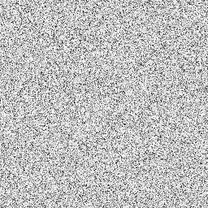
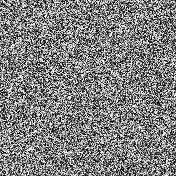

# pnggrain

Generates a pseudorandom grainy/staticy `.png`.

## Usage

```
pnggrain [<options> ...] [<filename>]
```

Default filename is `pnggrain.png`.  Specify a *filename* argument to
override it.  Use `-` as your *filename* argument to write the PNG to
stdout.  Use `./-` to write to a file called `-`.

## Options

-   `-W <int>` specifies image width (there's a default, it's 256).
-   `-H <int>` specifies image height (there's a default, it's 256).
-   `-t <int>` specifies minimum alpha channel value (default 0)
-   `-T <int>` specifies maximum alpha channel value (default 255)
-   `-m <int>` specifies minimum pixel value (default 0)
-   `-M <int>` specifies maximum pixel value (default 255)
-   `-n` (no transparency) sets the entire alpha channel to 255.
-   `-d` (darken only) sets all pixel values to 0.
-   `-b` (brighten only) sets all pixel values to 255.
-   `-h` or `-?` displays a help message.

## Examples

-   
-   
-   
-   

## Build Requirements

Requires [libpng](http://libpng.org/pub/png/libpng.html) and any C compiler.
